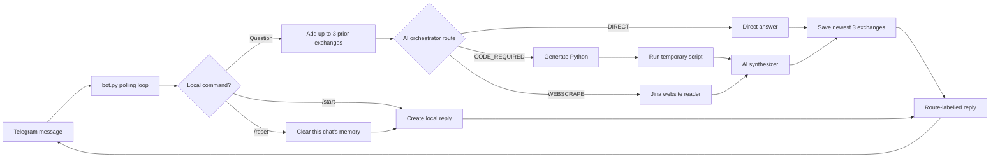

# Telegram Orchestration Memory Bot

A small Telegram bot that combines the previous AI orchestration with
three-turn, per-chat memory.

## The bot in five ideas

1. `load_dotenv()` loads the Telegram token from `.env`.
2. `getUpdates` waits for new Telegram messages.
3. `memory` is a dictionary: each chat ID points to its own list of messages.
4. `add_memory` puts the latest three exchanges before the new question.
5. `sendMessage` returns the orchestrator's answer to the same chat.

Everything Telegram-specific and memory-specific is in `bot.py`. The AI
routing details stay in `processQuery.py`, so a beginner can learn one part at
a time.

## Architecture

Normal questions pass through memory and the router. Commands stay local, so
`/start` and `/reset` do not consume an AI request.

- The orchestrator follows the completed lab notebook: it returns a direct
  answer, a detailed coding task, or a website URL.
- Counting, math, logic, and precise text work are strongly biased toward the
  generated-Python route.
- Recent conversation memory is included in the query before orchestration.
- `processQuery.py` contains routing, Python execution, webpage reading, and
  answer synthesis.
- `bot.py` contains all Telegram polling and conversation-memory logic.
- Replies state whether they used a direct answer, Python code, or website
  reader.
- Terminal logs show only the chat ID and selected route.
- `/reset` clears only the current chat's memory.
- `/start` and `/reset` are handled locally without an AI request.
- Memory lasts until the program is stopped and keeps the latest three turns.

## Setup

Python 3.10 or newer is required. Follow the complete
[Windows and macOS run guide](RUN_GUIDE.md) to create a virtual environment,
configure the API keys, run the offline tests, and start the bot.

Send these messages to the bot:

1. `My project is called Moss.`
2. `What is my project called?`
3. `/reset`
4. `What is my project called?`

It should remember `Moss` before `/reset` and forget it afterward.

## Routing check

Send `how many r's are in strawberry`. The reply should begin with
`Routed to: Python code`, and the answer should report three occurrences.
